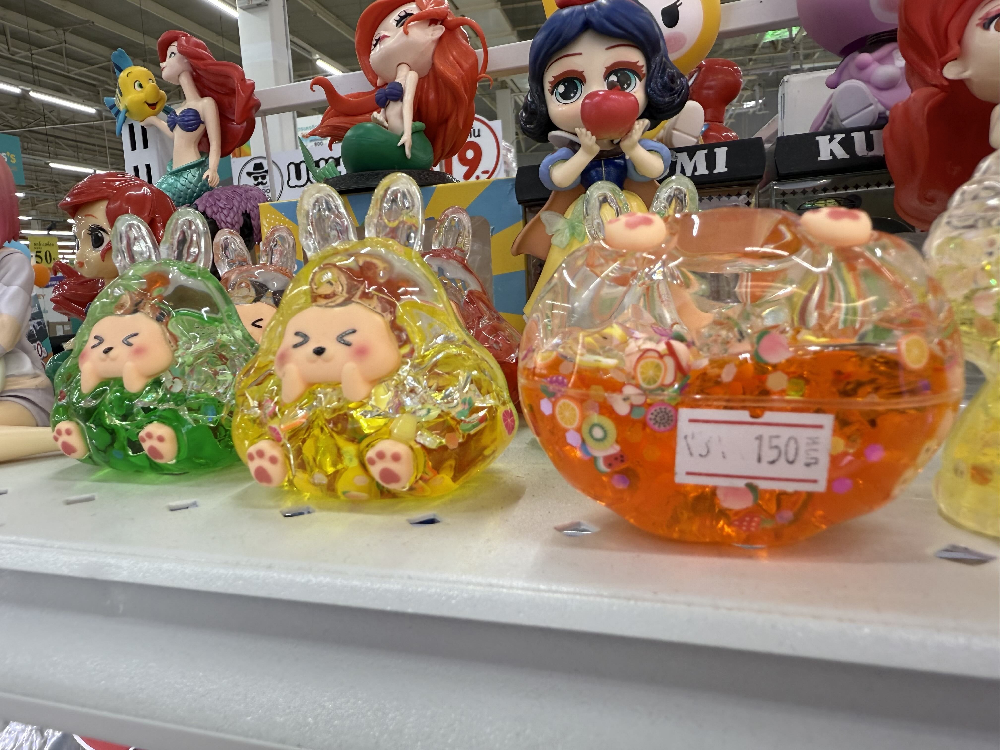

# 20250130_chiangrai

<html>
<head>

<meta charset="UTF-8">
<meta http-equiv="Content-Type" content="text/html; charset=UTF-8">
<meta http-equiv="X-UA-Compatible" content="IE=EmulateIE10" />
<meta http-equiv="X-UA-Compatible" content="IE=edge">

<!--ここから上はお決まりの定型文です-->

<!--ここからが表現の書式などを決めるcssという部分-->

<link href="https://cdnjs.cloudflare.com/ajax/libs/lightbox2/2.7.1/css/lightbox.css" rel="stylesheet">

</head>

<body>

モバイル端末をお使いの場合は、画面を横向きにすると
より見やすくご覧頂けます。

<!--ここ上は、ほぼそのまま使います！-->

<!--QRコードの挿入例-->

 アクセス用QRコード

<marquee direction="left" scrollamount="20" width="30%">(^_^)/~alis</marquee>

<!--流れ文字の挿入例-->
<h1><marquee behavior="left">!!! 2025/01/30、日章旗のような朝日でスタート、アヒルのヒナを保護した後はプールと買い物!!!</marquee></h1>

                          

<!--ここから下が、本体部分-->

<h2>夜明けの過程で朝日と雲の関係がうまく作用して日章旗状態に</h2>

    
<h2>遺品のPCに無線のソフト入れて無線機と接続し電波を出さないアマチュア無線機に 右のPCはメタバースやLINE専用端末です</h2>

    
<h2>アヒル一家がヒナを置き去りにし始めたので一時保護</h2>

    
<h2>こんなカゴに入れて親鳥の落ち着きを待ちます</h2>

    
<h2>午後はいつもの王立メーファールーアン大学のプールで軽く練習</h2>

    
<h2>この時間だと一人ですが、奥のトレーニングルームにいる若者たちに見られてました</h2>

    
<h2>せっかくなのでプールバックに一枚パチリ！</h2>

    
<h2>いつも感心するのは入り口建屋の花壇のお花</h2>

    
<h2>熱帯の陽射しを浴びてオレンジ色が映えます</h2>

    
<h2>大学入り口の花壇はちょうど植え替え中でした</h2>

    
<h2>大きなスーパーでは、若者や家族連れが目立ちます</h2>

    
<h2>こんな商品棚もあります</h2>

    
<h2>日本のキャラは値段が一桁上がってます</h2>

    
<h2>街の市場になると、客層の年齢がグッと上がって一安心</h2>

    
<h2>いつもの夕焼けグラデーション</h2>

    
<h2>最後は星空ですが、30日(木)の冬のダイヤモンド(たどり方は次の画像で)</h2>

    
<h2>こちらが１週間前の23日(木)の同じ空、恒星の位置は同じですが、火星と木星の位置が少し動きました</h2>

<h2>BGMはこのところ邦楽寄り、しかもかなりの懐かし系</h2>
<iframe width="560" height="315" src="https://www.youtube.com/embed/jv4ijMEJ1g0?si=MQ-18imKSZxjEC1Y" title="YouTube video player" frameborder="0" allow="accelerometer; autoplay; clipboard-write; encrypted-media; gyroscope; picture-in-picture; web-share" referrerpolicy="strict-origin-when-cross-origin" allowfullscreen></iframe> 

   
<h2>以上、日章旗のような朝日でスタートしてアヒルのヒナを保護 プールでひと泳ぎしたあとはお買い物でした ここまで観ていただきありがとうございました。</h2>

     
<h2>
<a href="https://torokoid.github.io/20241126_chiangrai/" target="_blank">Back to the menu page</a>
</h2>

   

         

  

      

<!--本体はここまで-->

<!--画面に空白地帯を作って、背景が見えるようにしています-->
                                              

<!-- フッタ -->
<footer>

Copyright 2025/01/31 alis @ChiangRai

</footer>

<!--HPにさまざまなJavaScriptを呼び込むための書式-->

